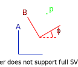

# Control Systems

## State Space

Let the states be:
$$
\begin{rcases}
    x_{1} = x_{1}(t) & \\
    x_{2} = x_{2}(t) & \\
\end{rcases} \text{ states}
$$

> States captures all dynamics of the system.

Let the input be:
$$
\begin{rcases}
    u_{1} &= u(t) & \\
\end{rcases} \text{ input}
$$

Let the output be:
$$
\begin{rcases}
    y_{1} &= x_{1} & \\
    y_{2} &= x_{2} & \\
\end{rcases} \text{ output}
$$

Where:
$$
\begin{aligned}
    \vec{x} = \left(\begin{matrix} x_{1} \\ x_{2} \end{matrix}\right) & \\\\
    \begin{rcases}
        \vec{\dot{x}} = A\vec{x} + B\vec{u} & \\
        y = C\vec{x} + D\vec{u} & \\
    \end{rcases} & \text{ state-space}
\end{aligned}
$$

- $C$: allows selection of output dependent on states and inputs.

Get:
$$
\vec{\dot{x}} = \left(\begin{matrix} \dot{x_{1}} \\ \dot{x_{2}} \end{matrix}\right)
$$

Rearrange:
$$
\vec{\dot{x}} = \left(\begin{matrix} a & b \\ c & d \end{matrix}\right)\left(\begin{matrix} x_{1} \\ x_{2} \end{matrix}\right) + \left(\begin{matrix} e \\ f \end{matrix}\right)u_{1}
$$

Get:
$$
\vec{y} = \left(\begin{matrix} y_{1} \\ y_{2} \end{matrix}\right) = \left(\begin{matrix} 1 & 0 \\ 0 & 1 \end{matrix}\right)\left(\begin{matrix} x_{1} \\ x_{2} \end{matrix}\right) + \left(\begin{matrix} e \\ f \end{matrix}\right)u_{1}
$$

## Euler Method

Euler's method can be used to discretise systems.

$$
\begin{aligned}
    \frac{dx(t)}{dt} &= f\left(x(t), \; u(t) \right) \\
    x(t + \tau) &= x(t) + \tau \cdot f\left(x(t),\; u(t)\right)
\end{aligned}
$$

## Observers

Observers are used to estimate the unmeasured states, $X$, of a system from its outputs, $Y$.

```mermaid
graph LR
    U --> in(( )) --> plant --> out(( )) --> Y
    out --> observer --> obs_out(( )) --> X[estimated X]
    in --> observer
```

$$
\dot{\hat{x}}(t) = A\hat{x}(t) + B\vec{u}(t) + \overbrace{L\left(\vec{y}(t) - \hat{y}(t) \right)}^{\text{correction}(t)}
$$

- $\hat{x}(t)$ is the estimated state.
- $L$ is the observer gain which is unknown and can be solved:
$$
\begin{aligned}
    \lambda(A - LC) \Rightarrow
    \begin{cases}
        \hat{c}(t) = (A - LC) \cdot c(t) \\
        c(t) = \hat{x}(t) - x(t)
    \end{cases}
\end{aligned}
$$

- $\dot{c}(t)$ is the dynamics of error.

## Coordinate Frames

$$
\begin{aligned}
    \vec{p}_{B} = \vec{R}_{A \rightarrow B} \cdot \vec{p}_{A} + \vec{T}_{A \rightarrow B}
\end{aligned}
$$

- $R$ is the rotation matrix.
$$
\begin{aligned}
    \vec{R}_{A \rightarrow B} &= (\vec{b}_{A, 1}\text{ , ... , } \vec{b}_{A, n})^{T} \\
    \vec{R}_{A \rightarrow B} &= \left(\vec{R}_{B \rightarrow A}\right)^{-1} = \left(\vec{R}_{B \rightarrow A}\right)^{T}
\end{aligned}
$$

- $T$ is the translation matrix.

In 2D:
$$
R_{\phi} = \left(\begin{matrix} cos(\phi) & -sin(\phi) \\ sin(\phi) & cos(\phi) \end{matrix}\right)
$$