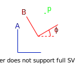

# Linear Algebra

## Coordinate Frames

$$
\begin{aligned}
    \vec{p}_{B} = \vec{R}_{A \rightarrow B} \cdot \vec{p}_{A} + \vec{T}_{A \rightarrow B}
\end{aligned}
$$

In 2D, where $\phi$ is the angle between the two coordinate frames:
$$
\vec{R}_{\phi} = \left(\begin{matrix} cos(\phi) & -sin(\phi) \\ sin(\phi) & cos(\phi) \end{matrix}\right)
$$

$R$ is the rotation matrix:
$$
\vec{R}_{A \rightarrow B} = (\vec{b}_{A, 1}\text{ , ... , } \vec{b}_{A, n})^{T}
$$

If the direction of the rotation matrix was inversed:
$$
\vec{R}_{A \rightarrow B} = \left(\vec{R}_{B \rightarrow A}\right)^{-1} = \left(\vec{R}_{B \rightarrow A}\right)^{T}
$$

$T$ is the translation matrix:
$$
\vec{T}_{A \rightarrow B} = \vec{p}_{B} - \vec{p}_{A}
$$
